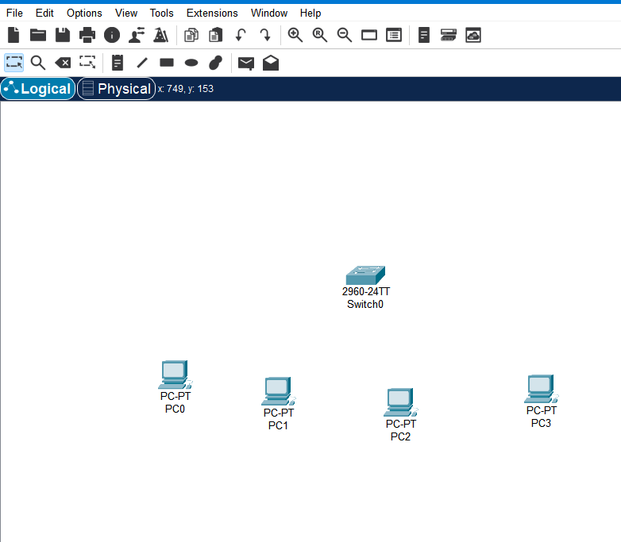
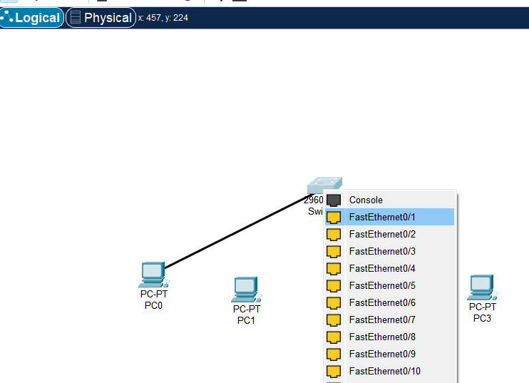
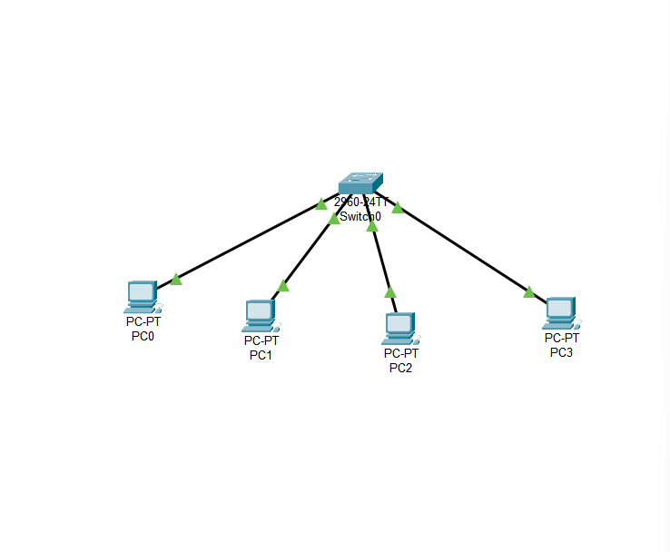
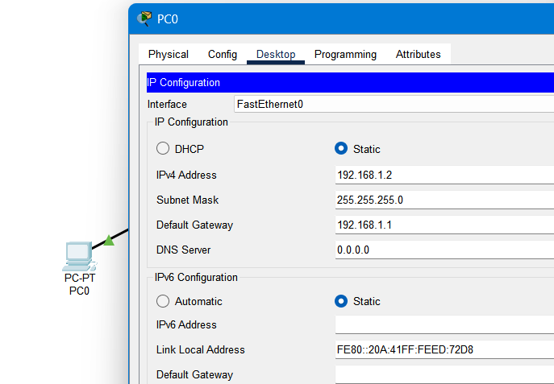
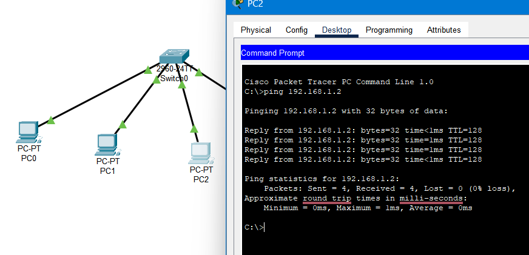

# 🖧 Peer-to-Peer Network Lab – Cisco Packet Tracer

This project demonstrates a **peer-to-peer network topology** in Cisco Packet Tracer. The goal of this lab was to manually configure IP addresses, cable the network, and verify end-to-end connectivity using ICMP (ping).

---

## 🧰 Lab Overview

- Devices: 4x PCs, 1x Switch
- Cables: Copper Straight-Through
- IP Assignment: Static (manually set on each PC)
- Verification: Ping test using Command Prompt

---

## 🖼️ Screenshots

### 1. Initial Device Layout
> Start the project with 1 switch and 4 PCs

---

### 2. Connecting the First Device
> PC0 is connected to FastEthernet0/1 on the switch using a straight-through cable.

---

### 3. Completed Network Topology
> All PCs are connected to the switch via individual FastEthernet ports:

| PC  | Port on Switch     |
|-----|--------------------|
| PC0 | FastEthernet0/1    |
| PC1 | FastEthernet0/2    |
| PC2 | FastEthernet0/3    |
| PC3 | FastEthernet0/4    |

> This design ensures each device has a dedicated bandwidth path to the switch, supporting efficient local communication.

---

### 4. Static IP Configuration
> Each PC is manually assigned a static IP address within the same subnet (`192.168.1.0/24`) using the same subnet mask and default gateway.

| PC  | IP Address     | Subnet Mask     | Default Gateway |
|-----|----------------|------------------|------------------|
| PC0 | 192.168.1.2    | 255.255.255.0    | 192.168.1.1      |
| PC1 | 192.168.1.3    | 255.255.255.0    | 192.168.1.1      |
| PC2 | 192.168.1.4    | 255.255.255.0    | 192.168.1.1      |
| PC3 | 192.168.1.5    | 255.255.255.0    | 192.168.1.1      |

> Each PC increases the last octet of the IP by one, starting from `.2`, ensuring that all addresses are within the same subnet and avoid conflicts.

---

### 5. Ping Test Between Devices
>PC2 sends a ping to PC0’s IP (192.168.1.2) and receives successful replies, confirming end-to-end network connectivity.

---

## 💡 Skills Practiced

- Static IP addressing
- Cable selection and port mapping
- Command-line ping verification
- Network topology planning and configuration

---

## 📂 Files Included

| File | Description |
|------|-------------|
| [`Building Client Server Network.pkt`](./Building%20Client%20Server%20Network.pkt) | Cisco Packet Tracer file |
| [`ss1.png`](./ss1.png) → [`ss5.png`](./ss5.png) | Screenshots of topology, config, testing |
| [`README.md`](./README.md) | Documentation (this file) |

---

## 👨‍💻 Author

**Anthony Alston**  
UT Dallas – Junior, Information Technology Systems  
🔐 Cybersecurity & Networking Enthusiast  
📫 tosha.alston@gmail.com  
🌐 [GitHub Profile](https://github.com/AnthonyAAlston)
